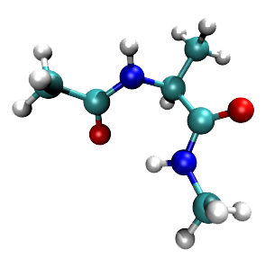

pDynamo is an open source program library that has been designed for the simulation of molecular systems using quantum chemical
(QC), molecular mechanical (MM) and hybrid QC/MM potential energy functions. pDynamo is written in Python with the computationally
intensive parts of the code implemented in C and Cython. The current version of pDynamo, pDynamo3, uses Python 3.

Principal author: Martin Field

Development team: <dynamo.modeling@gmail.com>

Released under the [GNU General Public License](gpl-3.0.txt)

## Features of pDynamo3
  - Density functional theory and Hartree-Fock QC methods employing Gaussian basis sets
  - Semi-empirical QC methods of the MNDO type, including AM1, MNDO, PDDG, PM3, RM1 and PM6
  - Support for some standard MM force fields, including AMBER, CHARMM and OPLS-AA
  - Hybrid QC/MM methods using any combination of the QC and MM potentials implemented in the library
  - Coupling to third-party programs
  - Energy calculations
  - Geometry optimizations
  - Transition state searches
  - Reaction path calculations
  - Normal mode analyses
  - Property calculations, such as charges and dipoles
  - Molecular dynamics simulations
  - Monte Carlo simulations
  - Various geometrical restraints
  - The ability to handle various common molecular file formats
  - Miscellaneous analysis tools

## Citation
If you use pDynamo in your work, please cite:

  - M. J. Field, ["The *pDynamo* Library for Molecular Simulations using Hybrid Quantum Mechanical and Molecular Mechanical Potentials"](https://pubs.acs.org/doi/10.1021/ct800092p), *J. Chem. Theo. Comp.* **2008**, *4*, 1151-1161.
  - M. J. Field, ["A Practical Introduction to the Simulation of Molecular Systems"](https://www.cambridge.org/core/books/practical-introduction-to-the-simulation-of-molecular-systems/E91B9A8E90237C3D63F6A589105FF38B), *Cambridge University Press.* **2007**.

## Installation instructions
Required software and libraries:

  - Python 3, version 3.5 or higher (including header files; python3-dev package in Debian)
  - [Cython](https://cython.org/) (cython3 package in Debian)
  - PyYAML (python3-yaml package in Debian)
  - C compiler (gcc or other)

Download the newest version of pDynamo3 from GitHub either as a zip file or as a repository using ```git clone https://github.com/dynamo.modeling/pdynamo3.git```. Unpack the zip file
or place the repository where pDynamo3 is to be installed.

Several modules within pDynamo3's packages and subpackages are written in C and Cython and have to be compiled before they can be used. To do this go to the installation directory of
pDynamo3 using ```cd installation``` and run the installation script by typing ```python3 Install.py -f```. Installation should take a few minutes.

Some environment variables need to be set for pDynamo3 to be used. To help users, example bash and cshell scripts are generated at the end of installation in the ```shellScripts```
subdirectory of ```installation```. These can be edited and placed so that they are executed as appropriate (for example at login or when a terminal is opened). Alternatively, users
can add the definitions to their own shell scripts. The following, using cshell as an example, is a minimal requirement for basic operation:

    # . The pDynamo3 home directory - edit as appropriate.
    setenv PDYNAMO3_HOME          $HOME/pDynamo3
    # . The pDynamo3 scratch directory - edit as desired.
    setenv PDYNAMO3_SCRATCH       $PDYNAMO3_HOME/scratch
    # . The python3 path - this must include PDYNAMO3_HOME but often includes paths for other programs as well.
    setenv PYTHONPATH             .:$PDYNAMO3_HOME
    # . Other variables that do not need to be changed.
    setenv PDYNAMO3_PARAMETERS    $PDYNAMO3_HOME/parameters
    setenv PDYNAMO3_PYTHONCOMMAND python3
    setenv PDYNAMO3_STYLE         $PDYNAMO3_PARAMETERS/ccsStyleSheets/defaultStyle.css

Finally, see if pDynamo3 works by running some simple tests that take a few minutes. This is done in the installation directory by typing ```python3 RunExamples.py book```. A full list
of the tests available may be obtained with the command ```python3 RunExamples.py -l```. Output logs from the examples, together with other generated files, will be found in the
```examples``` subdirectory of ```PDYNAMO3_SCRATCH```.

## Additional packages and programs

The pDynamo3 repository includes third-party extension packages in the ```addOns``` directory. Currently the principal ones are:

 - [pcetk](https://github.com/mfx9/pcetk) calculates proton binding energetics in proteins using a continuum electrostatics model.
 - [pyCPR](http://www.bisb.uni-bayreuth.de/index.php?page=data/PyCPR/PyCPR) searches for transition states on molecular potential energy surfaces using the conjugate peak refinement
   algorithm.
  -[PM6-ML](https://github.com/Honza-R/mopac-ml) Δ-ML (Delta Machine Learning) correction to semi-empirical PM6 energies and gradients.

Users should refer to the web pages of these packages for full details about their use.

In addition, several optional modules and add-ons in pDynamo3 employ third-party programs which need to be installed separately if they are to be used. They include the ```pcetk```
package which requires [extended-MEAD](http://www.bisb.uni-bayreuth.de/index.php?page=downloads), and the QC modules, ```QCModelDFTB```, ```QCModelORCA``` and ```QCModelPySCF```, which
need  [DFTB+](https://dftbplus.org/), [ORCA](https://orcaforum.kofo.mpg.de/app.php/portal) and [PySCF](https://github.com/pyscf/pyscf), respectively. Each of these programs also needs
an associated environment variable to be defined if they are to work with pDynamo3. Currently these extra variables are  ```PDYNAMO3_DFTBCOMMAND``` and ```PDYNAMO3_ORCACOMMAND``` which
indicate where DFTB+'s and ORCA's executables are located, ```PDYNAMO3_MEADPATH``` which points to extended-MEAD's ```bin``` directory, and ```PDYNAMO3_PYSCFPATH``` which is the path
to PySCF and which should be added to ```PYTHONPATH```. Using cshell again as example, this can be done as follows: 

    # . The python path with PySCF added.
    setenv PYTHONPATH .:$PDYNAMO3_HOME/:$PDYNAMO3_PYSCFPATH/

## Further information
Please see the [pDynamo website](https://sites.google.com/site/pdynamomodeling/home) for more detailed instructions and examples of use.
